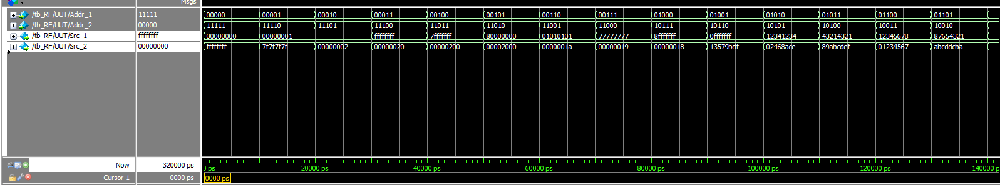
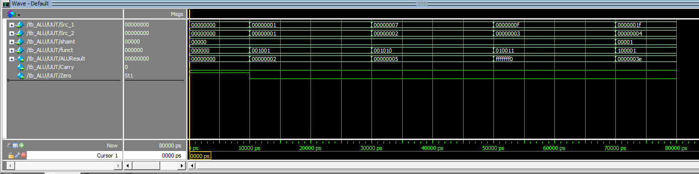
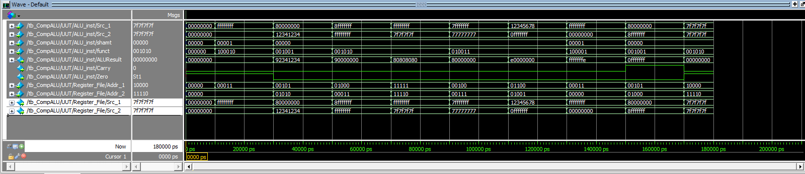

# 32-bit Complete ALU

A 32-bit Complete ALU implemented in Verilog HDL for the Computer Organization course.

---

## Features

- 32-bit Register File
- 32-bit Arithmetic Logic Unit
- Zero Flag
- Carry Flag

Supported Instructions

| Instruction | Function Code |
|-------------|---------------|
| ADDU | 001001 |
| SUBU | 001010 |
| NOR | 010011 |
| SLL | 100001 |

---

## Project Structure

```
RTL/
    ALU.v
    RF.v
    CompALU.v

result/
    tb_RF_waveform.png
    tb_ALU_waveform.png
    tb_CompALU_waveform.png

doc/
    HW1.pdf
```

---

## Functional Simulation

### Register File

The register file supports two read ports and is initialized using `RF.dat`.



---

### Arithmetic Logic Unit

The ALU supports:

- ADDU
- SUBU
- NOR
- SLL



---

### Complete ALU

The Complete ALU combines the Register File and ALU to execute a 32-bit instruction and outputs:

- ALUResult
- Zero
- Carry



---

## Verification

The RTL modules were verified using the course-provided testbench.

To respect the course materials, the instructor-provided testbench and test vectors are **not included** in this repository.

---

## Tools

- Verilog HDL
- ModelSim
- VS Code
- Git
